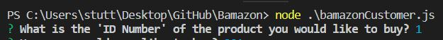
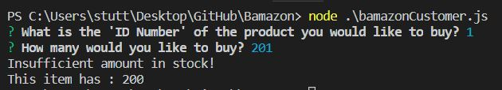
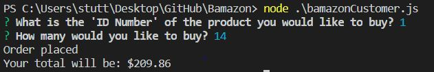

# Bamazon

"Bamazon" is a CLI app that is essentially an Amazon store front where the user enters their order and the app checks if what they want is in stock. If said item is in stock, the app will place their order.

The app useses the npm "inquirer" to ask the user the question "What is the 'ID Number' of the product you would like to buy?". You will enter an ID between 1-10 to get a response. Below, we're entering 1 for a costume.

When we try to order 201, they give us an error to show there are currently only a total of 200 in stock.

If we choose an amount that is in stock, the app totals our order for us, logs it, then updates the database with the amount remaining. The price is saved in the database relative to the item that is being purchased. In this case, the amount of costumes we ordered totaled out to be $209.86.

